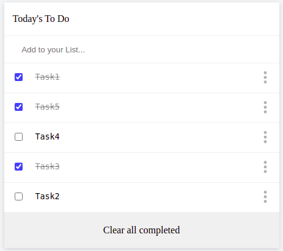

# Awesome_Books

> Implementing To Do List Using Javascript bestpractices and webpack. 


# Project Preview


# Live Demo

[ToDOList](https://abdona.github.io/ToDoList/dist)

## Built With

- HTML
- CSS
- JAVASCRIPT
- Webpack

## Installation

Clone this repo and npm install.

```bash
npm i
```

## Usage

### Development server

```bash
npm start
```

You can view the development server at `localhost:8080`.


## Authors

👤 **Abdulrahman**

- GitHub: [@Abdona](https://github.com/Abdona)
- LinkedIn: [LinkedIn](https://www.linkedin.com/in/abdulrahman-nasser-2b7173131/)

## 🤝 Contributing

Contributions, issues, and feature requests are welcome!

Feel free to check the [issues page](issues/).

## Show your support

Give a ⭐️ if you like this project!

## Dependencies

### webpack

- [`webpack`](https://github.com/webpack/webpack) - Module and asset bundler.
- [`webpack-cli`](https://github.com/webpack/webpack-cli) - Command line interface for webpack
- [`webpack-dev-server`](https://github.com/webpack/webpack-dev-server) - Development server for webpack
  
### Linters

- [`eslint`](https://github.com/eslint/eslint) - Enforce styleguide across application
- [`eslint-config-airbnb-base`](https://github.com/airbnb/javascript/tree/master/packages/eslint-config-airbnb-base) - Base styleguide to enforce rules

## Acknowledgments

- Microverse

## 📝 License

This project is [MIT](https://github.com/Abdona/ToDoList/blob/features_interactive/LICENSE) licensed.
